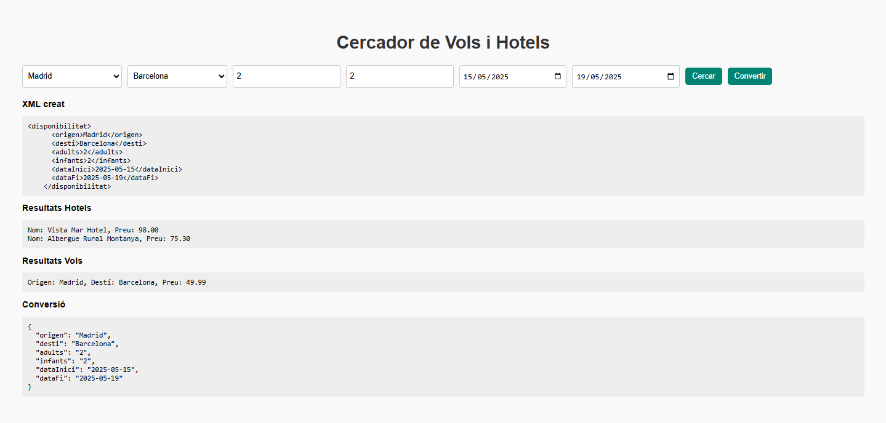

# Buscador de Vuelos

## Descripción

El **Buscador de Vuelos** es una aplicación diseñada para facilitar la búsqueda de vuelos mediante el uso de tecnologías como XML y JSON. Este proyecto es parte del curso de **1º DAM** en la asignatura de **Lenguaje de Marcas**.

## Características

- Búsqueda de vuelos por destino, fecha y precio.
- Uso de datos estructurados en formato XML y JSON.
- Interfaz intuitiva y fácil de usar.